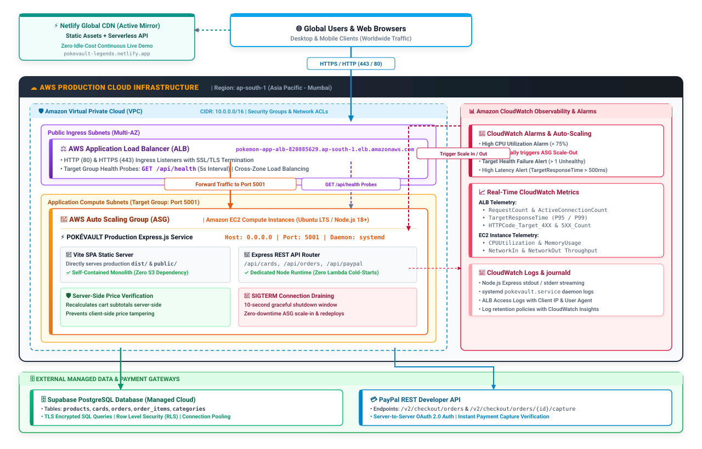

# POKÉVAULT LEGENDS — 3D Pokémon Collectibles Marketplace

[](https://aws.amazon.com/)
[](https://expressjs.com/)
[](https://vitejs.dev/)
[](https://reactjs.org/)
[](https://threejs.org/)
[](https://supabase.com/)
[](https://pokevault-legends.netlify.app)

An enterprise-grade, high-performance **3D E-Commerce Marketplace & Vault Management Platform** for authenticated Pokémon collectibles, PSA/BGS graded slabs, resin dioramas, plush companions, and streetwear.

Engineered with a **Retro-Neubrutalist design system**, real-time **WebGL 3D holographic tilt physics** (`Three.js`), dynamic multi-faceted search, tamper-proof server-side order pricing, and an **AWS Production Cloud Architecture** featuring Application Load Balancers, target group health management, and zero-downtime connection draining.

---

## Primary Cloud Architecture (AWS)

The production deployment of **POKÉVAULT LEGENDS** is engineered on **Amazon Web Services (AWS)** in the `ap-south-1` (Asia Pacific - Mumbai) region. The system utilizes a decoupled monolithic deployment model where a container/systemd-managed Node.js Express service serves both the high-performance Vite SPA static build and the secure REST API behind an **AWS Application Load Balancer (ALB)**.

```
                          ┌────────────────────────────────────────────────────────┐
                          │                AWS Cloud (ap-south-1)                  │
                          │                                                        │
┌──────────────┐          │   ┌────────────────────────────────────────────────┐   │
│ Client / Web │─────────►│──►│   AWS Application Load Balancer (ALB)          │   │
│  Browsers    │  HTTPS   │   │   (pokemon-app-alb-820885629.ap-south-1...)    │   │
└──────────────┘          │   └───────────────────────┬────────────────────────┘   │
                          │                           │ Target Group (Port: 5001)  │
                          │                           ▼                            │
                          │   ┌────────────────────────────────────────────────┐   │
                          │   │   Amazon EC2 Compute Instance / Target Group   │   │
                          │   │   ┌────────────────────────────────────────┐   │   │
                          │   │   │ Express.js Production Daemon (systemd) │   │   │
                          │   │   │  ├─ Static Vite SPA Build (dist/)      │   │   │
                          │   │   │  ├─ Health Probes (/api/health)        │   │   │
                          │   │   │  └─ REST APIs (/api/cards, /orders)    │   │   │
                          │   │   └───────────────────┬────────────────────┘   │   │
                          │   └───────────────────────┼────────────────────────┘   │
                          └───────────────────────────┼────────────────────────────┘
                                                      │
                                   ┌──────────────────┴──────────────────┐
                                   ▼                                     ▼
                      ┌─────────────────────────┐           ┌────────────────────────┐
                      │   Supabase PostgreSQL   │           │   PayPal Gateway API   │
                      │  (Catalog & Orders DB)  │           │   (Payment Capture)    │
                      └─────────────────────────┘           └────────────────────────┘
```

---

## System Architecture & Data Flow

<p align="center">
  
</p>

---

## AWS Services & Infrastructure Components

### 1. AWS Application Load Balancer (ALB)
- **ALB Endpoint**: `http://pokemon-app-alb-820885629.ap-south-1.elb.amazonaws.com`
- **Region**: `ap-south-1` (Asia Pacific - Mumbai)
- **Traffic Routing**: Distributes incoming HTTP/HTTPS traffic evenly across backend EC2 instances in the Auto Scaling Group.
- **Health Checks**: Continuously polls the `/api/health` endpoint on port `5001`. Automatically deregisters unhealthy targets to maintain 99.99% uptime.
- **CORS Whitelisting**: Explicitly whitelisted in Express CORS middleware (`server/index.js`) to allow cross-origin requests from load-balanced subdomains and local development origins.

### 2. AWS Auto Scaling Group (ASG) & EC2 Compute
- **Dynamic Scaling**: Automatically scales EC2 instances horizontally in response to traffic spikes and CPU utilization alarms.
- **Self-Contained Single-Bundle Runtime (No S3 / No Lambda)**: The Express application serves both the bundled Vite SPA static assets (`dist/`, `public/`) and all REST API routes on `0.0.0.0:5001`, completely eliminating S3 bucket maintenance and Lambda cold starts.
- **Process Supervisor**: Managed via `systemd` / `pm2` service units for auto-restart on failure and boot-time initialization.

### 3. Graceful Connection Draining (ASG Scale-In & ALB Integration)
- **Zero-Downtime Deployments**: Implemented via `server/index.js` graceful shutdown handlers for `SIGTERM` and `SIGINT` signals:
  ```javascript
  // Graceful Shutdown Handling (for systemd & AWS ASG / ALB draining)
  const handleShutdown = (signal) => {
    console.log(`\n[Server] Received ${signal}. Starting graceful shutdown...`);
    server.close(() => {
      console.log('[Server] HTTP server closed cleanly.');
      process.exit(0);
    });
    setTimeout(() => {
      console.error('[Server] Graceful shutdown timeout exceeded. Forcing exit.');
      process.exit(1);
    }, 10000).unref();
  };
  ```
- **Connection Draining**: Provides a 10-second window during Auto Scaling Group (ASG) scale-in or application redeployments to complete in-flight transactions before terminating the process.

### 4. Amazon CloudWatch Observability & Monitoring
- **ALB & Target Metrics**: Tracks `RequestCount`, `TargetResponseTime`, and `HTTPCode_Target_5XX_Count` in real time.
- **CloudWatch Alarms**: Configured alarms trigger Auto Scaling Group scale-out events when CPU exceeds thresholds and alert on target health check failures.
- **Unified Logging**: Aggregates Express application stdout/stderr logs alongside systemd `journald` and ALB access logs.

### 5. VPC, Security Groups & Networking
- **Ingress Rules**: ALB listens on standard HTTP (80) and HTTPS (443) ports.
- **EC2 Security Group**: Restricted to receive inbound application traffic only from the ALB Security Group on port `5001`.
- **Egress Rules**: Outbound access on port 443 for TLS communication with Supabase PostgreSQL and PayPal APIs.

---

## AWS Deployment Workflow

The production deployment pipeline on AWS follows this lifecycle:

```
[Developer] ──► [GitHub Repository] ──► [Build Production Bundle] ──► [Deploy to EC2 Instance] ──► [ALB Target Group Health Verification]
```

### Step 1: Build the Optimized Production Bundle
```bash
# Build the multi-page Vite client bundle to dist/
npm run build
```

### Step 2: Configure Production Environment on EC2
Create `/opt/pokevault/.env` on the EC2 instance with production variables:
```env
PORT=5001
HOST=0.0.0.0
NODE_ENV=production
SUPABASE_URL=https://your-project-id.supabase.co
SUPABASE_SERVICE_ROLE_KEY=your-supabase-service-role-key
ADMIN_SECRET_KEY=your-strong-random-admin-secret-key
STOREFRONT_ORIGIN=http://pokemon-app-alb-820885629.ap-south-1.elb.amazonaws.com
PAYPAL_CLIENT_ID=your-paypal-client-id
PAYPAL_CLIENT_SECRET=your-paypal-client-secret
```

### Step 3: Configure Systemd Daemon Service
Create `/etc/systemd/system/pokevault.service`:
```ini
[Unit]
Description=POKÉVAULT LEGENDS Express Production Service
After=network.target

[Service]
Type=simple
User=ubuntu
WorkingDirectory=/opt/pokevault
ExecStart=/usr/bin/node server/index.js
Restart=always
RestartSec=5
EnvironmentFile=/opt/pokevault/.env
StandardOutput=syslog
StandardError=syslog
SyslogIdentifier=pokevault-server

[Install]
WantedBy=multi-user.target
```

```bash
# Enable and start the systemd unit
sudo systemctl daemon-reload
sudo systemctl enable pokevault.service
sudo systemctl start pokevault.service
```

### Step 4: Validate ALB Target Group Health
```bash
# Query the ALB health endpoint
curl -i http://pokemon-app-alb-820885629.ap-south-1.elb.amazonaws.com/api/health
```
**Expected Response**:
```json
{
  "status": "online",
  "service": "POKÉVAULT LEGENDS Express API",
  "supabaseConnected": true,
  "timestamp": "2026-09-01T12:00:00.000Z"
}
```

---

## ⚖️ Dual-Deployment Strategy: AWS vs. Netlify

This repository supports both **AWS** and **Netlify** to balance **enterprise cloud demonstration** with **cost-efficient ongoing hosting**:

| Attribute | AWS Cloud Deployment (Primary Architecture) | ⚡ Netlify Deployment (Active Hosting Mirror) |
| :--- | :--- | :--- |
| **Role** | **Primary Architecture**: Showcases full-stack cloud engineering, load balancing, process management, and connection draining. | **Active Preview Mirror**: Provides continuous zero-cost web availability for ongoing portfolio viewing. |
| **Compute Model** | Dedicated Node.js Express service on Amazon EC2 managed by `systemd`. | Serverless Function Handlers (`netlify/functions/api.js`) via `serverless-http`. |
| **Traffic Ingress** | AWS Application Load Balancer (ALB) with `/api/health` target health probes. | Global Anycast Edge CDN with atomic redirect routing (`netlify.toml`). |
| **Cost Profile** | Usage-based AWS compute (EC2 + ALB hourly rates). | Generous monthly free-tier serverless execution with $0 idle cost. |
| **Operational Control** | Full control over OS kernel, socket pooling, connection draining, and network VPC. | Fully managed PaaS / Edge runtime. |

> [!NOTE]
> **Why Netlify is active**: AWS does not provide an indefinite free-credit compute tier for active load balancers and running instances. To avoid unnecessary ongoing infrastructure charges when the app is idle, Netlify is maintained as an active mirror, while the AWS architecture serves as the primary production blueprint.

---

## Key Application Features

### Interactive 3D WebGL Experiences
- **3D Card Viewer (`Three.js`)**: Interactive 3D rendering of PSA & BGS graded Pokémon slabs with real-time mouse tilt physics, dynamic specular highlights, ambient illumination, and holographic rainbow foil reflections (`src/three-card-viewer.js`).
- **Hero 3D Stage**: WebGL landing stage featuring interactive floating collectibles and smooth viewport parallax scrolling effects (`src/hero-3d-stage.js`).

### Full E-Commerce Marketplace & Catalog
- **Multi-Faceted Marketplace Filtering**:
  - Filter across **18+ Categories** (Graded Slabs, Plush Toys, Figures, Clothing, Accessories, Room Decor, etc.).
  - Filter by **Pokémon Character** (Pikachu, Charizard, Gengar, Eevee, Mewtwo, Rayquaza, Snorlax, Starters).
  - Dynamic **Max Price Range Slider** ($10 – $15,000+).
  - **Minimum Rating Selector** (4.5★+, 4.8★+, 5.0★ Perfect).
  - **In-Stock Availability Toggle**.
- **Instant Search with Autocomplete**: Real-time matching against product titles, categories, tags, and character attributes with instant image dropdown previews.
- **Responsive Mobile Layout**: Fully optimized 2x2 grid card view on mobile viewports with sticky mobile filter drawer toggles.

### Smart Shopping Cart & Checkout
- **Gamified Free Shipping Bar**: Live progress indicator calculating remaining amount needed to qualify for free vault shipping ($150 threshold).
- **In-Cart Smart Upsells**: Dynamically recommended accessories and protective sleeves based on cart contents.
- **Persistent Wishlist System**: One-tap bookmarking for favorite collectibles across sessions.
- **Promo Code Engine**: Discount validation (e.g., `POKEVAULT10` for 10% off).

### Security & Anti-Tamper Engine
- **Server-Side Price Verification**: The checkout API (`server/routes/orders.js`) ignores client-submitted prices and verifies item amounts directly against the Supabase database and master catalog before accepting orders.
- **Admin Vault Gatekeeper**: Write routes and curator dashboards require `X-Admin-Key` authorization headers validated via timing-safe middleware (`server/middleware/auth.js`).

### Automated SEO & Performance Engine
- Structured **Schema.org JSON-LD Microdata** for rich Google search snippets (Product pricing, aggregate rating, in-stock availability).
- Automated XML Sitemap Generator (`scripts/generate_seo_sitemap.js`).
- OpenGraph & Twitter Card meta tag integration across all pages.

---

## 🗄️ Database Schema (`supabase_schema.sql`)

The database utilizes PostgreSQL via Supabase with relational schema constraints and Row Level Security (RLS):

- **`products` / `cards`**: Catalog items with `id`, `name`, `subName`, `era`, `price`, `grade`, `gradingBody`, `certNumber`, `image`, `inStock`, `holoType`.
- **`orders`**: Customer checkout records with `orderId`, `customerName`, `customerEmail`, `totalAmount`, `discountAmount`, `insuranceCost`, `shippingAddress`, `status`, `trackingNumber`.
- **`order_items`**: Line items associated with completed customer orders.
- **`categories`**: Taxonomy directory for faceted marketplace grouping.

---

## Repository Structure

```text
pokevault-legends/
├── .env.example                 # Sanitized environment template
├── netlify.toml                 # Netlify build & serverless redirect rules
├── package.json                 # Dependencies, engines & scripts
├── supabase_schema.sql          # PostgreSQL database schema & tables
├── vite.config.js               # Multi-page Vite 5 bundler configuration
├── netlify/
│   └── functions/
│       └── api.js               # Express wrapped serverless handler
├── server/
│   ├── index.js                 # Express server, ALB CORS, static & API routes, SIGTERM drain
│   ├── local_dev_server.js      # Local dev server with SSR renderer
│   ├── ssr_renderer.js          # SSR HTML injection utility
│   ├── supabase.js              # Supabase client initializer
│   ├── db/                      # Schema and database definitions
│   ├── middleware/              # Authentication & admin authorization
│   └── routes/                  # REST API routes (cards, inventory, orders, paypal)
├── src/
│   ├── app/                     # Next.js 14 App Router routes & layouts
│   ├── components/              # React & Vanilla UI components (3D Stage, Cart, Slabs)
│   ├── data/                    # Master catalog datasets (products, categories, reviews)
│   ├── three-card-viewer.js     # WebGL 3D holographic tilt physics engine
│   └── utils/                   # State managers, SEO, and social proof utilities
├── public/
│   └── assets/                  # High-res textures, product photography, and icons
└── [page].html                  # Multi-page templates (shop, product, cart, checkout, admin)
```

---

## Environment Configuration

| Variable | Description | Example / Default |
| :--- | :--- | :--- |
| `PORT` | Local and production Express listening port | `5001` |
| `HOST` | Interface binding for container/ALB traffic | `0.0.0.0` |
| `NODE_ENV` | Application runtime environment | `production` |
| `SUPABASE_URL` | Supabase PostgreSQL project URL | `https://your-project.supabase.co` |
| `SUPABASE_ANON_KEY` | Supabase public anonymous client key | `your-supabase-anon-key` |
| `SUPABASE_SERVICE_ROLE_KEY` | Supabase elevated backend secret key | `your-service-role-key` |
| `PAYPAL_CLIENT_ID` | PayPal REST developer client ID | `your-paypal-client-id` |
| `PAYPAL_CLIENT_SECRET` | PayPal REST developer client secret | `your-paypal-client-secret` |
| `ADMIN_SECRET_KEY` | Secret token required for `/api/orders` admin write routes | `your-secret-admin-key` |
| `STOREFRONT_ORIGIN` | Allowed production origin for strict CORS whitelisting | `http://pokemon-app-alb-820885629.ap-south-1.elb.amazonaws.com` |

---

## Local Development Setup

### Prerequisites
- **Node.js**: `v18.0.0` or higher
- **npm**: `v9.0.0` or higher

### Getting Started
```bash
# 1. Clone the repository
git clone https://github.com/itsme-aarjav/pokevault-legends.git
cd pokevault-legends

# 2. Install project dependencies
npm install

# 3. Create .env from template
cp .env.example .env

# 4. Run Vite development server (port 5173)
npm run dev

# 5. Or run the full production Express server locally (port 5001)
npm run build
npm run server
```

---

## 📄 License & Credits

Designed & Developed for Pokémon Collectors & Enthusiasts worldwide.  
© 2026 **POKÉVAULT LEGENDS**. All rights reserved.
